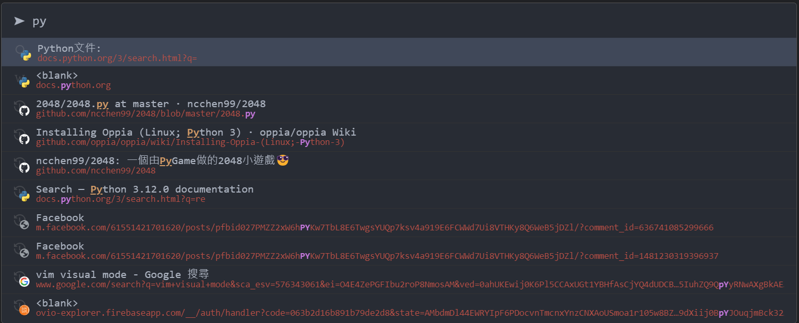

# vimium-c-one-dark-pro

One dark pro theme for vimium-c browser extension

## Preview

Dark

Link Hint

Search (right bottom corner)

Light

## Credits

- This theme is built with [vimiumc-themes](https://github.com/Darukutsu/vimiumc-themes)
- The color palette is from VSCode [One Dark Pro](https://marketplace.visualstudio.com/items?itemName=zhuangtongfa.Material-theme) theme.

## How to use

1. Copy the `one-dark-pro.css` file's content
2. Paste it in your vimium C "Custom CSS for Vimium C UI"（自定義介面樣式）
3. Click save

## How to modify

This repo keeps the `root.css` and `template.css` for building the theme. You can reference [the tutorial](https://github.com/Darukutsu/vimiumc-themes#how-to-create-custom-theme-using-script) to learn how to use it.
